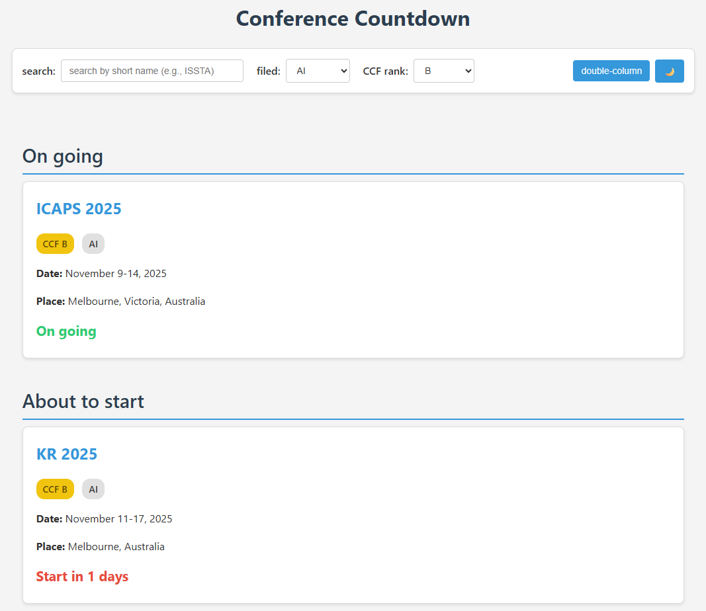

# CCF-Conf-Date

A simple, serverless website that tracks the start dates of academic conferences. This project fetches data daily from the `ccfddl/ccf-deadlines` repository and displays an interactive countdown for upcoming and ongoing conferences.

**[CCF-Conf-Date](https://shiftw041.github.io/CCF-Conf-Date/)** 

## 🌐 Preview

The webpage seems to be displayed as follows.

## ✨ Key Features

This project is inspired by `ccfddl/ccf-deadlines` but focuses on **conference progress dates** instead of submission deadlines.

  * **Smart Categorization:** Automatically displays conferences in two distinct groups: **"Ongoing"** and **"Upcoming"**.
  * **Powerful Filtering:**
      * Instant search by conference abbreviation (e.g., "ISSTA").
      * Filter by academic field (e.g., "SE", "AI", "DB").
      * Filter by **CCF Rank** (A, B, C, or N/A).
  * **Customizable UI:**
      * Toggle between single-column and double-column layouts.
      * **Dark Mode** & Light Mode support (remembers your choice).
      * Responsive design for both mobile and desktop.
  * **Utility:** Includes a "Scroll to Top" button for easy navigation on long lists.
  * **Always Up-to-Date:** Automatically syncs with the `ccf-deadlines` repository every day.

## 🛠️ How It Works

This project runs entirely for free on GitHub, requiring no external servers just using GitHub Action and GitHub Pages.

## 🙏 Acknowledgements

This project would not be possible without the data meticulously maintained by the contributors of the [ccfddl/ccf-deadlines](https://github.com/ccfddl/ccf-deadlines) repository.
